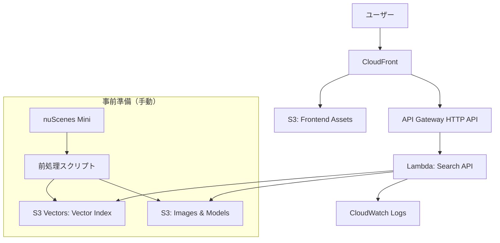
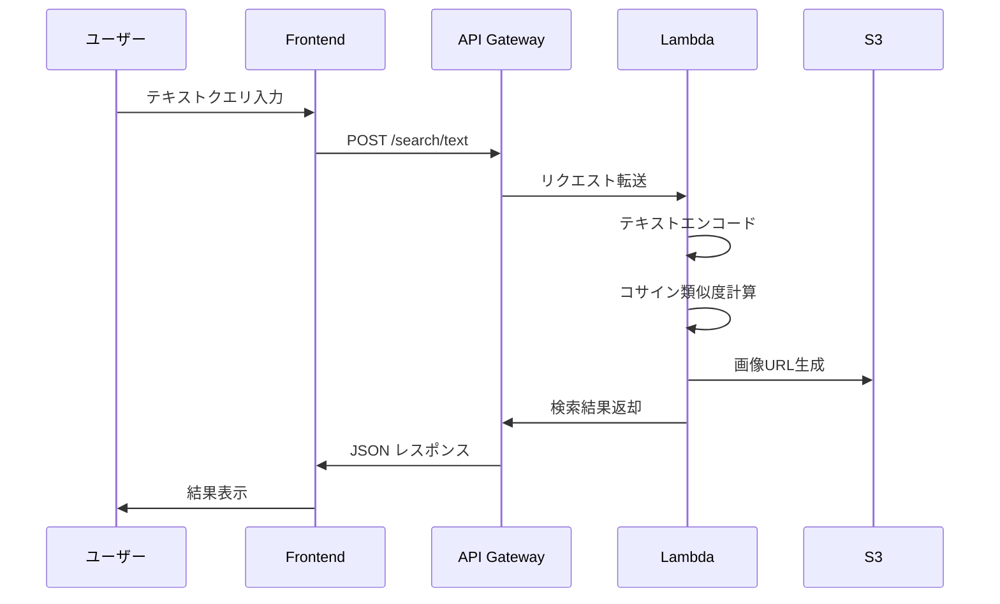
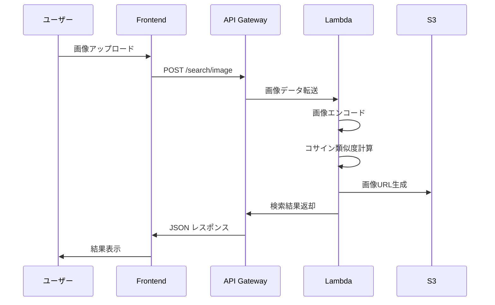

# 設計書

## 概要

本システムは、nuScenesデータセットを使用した自動運転シーン検索システムです。テキストと画像によるマルチモーダル検索を提供し、AWSサーバーレスアーキテクチャで低コスト運用を実現します。既存のミーム検索システムをベースに、自動運転データに特化した機能を追加します。

### 主要機能
- テキストベースのシーン検索
- 画像ベースのシーン検索
- S3 Vectors (GA) による高速ベクトル検索
- AWSサーバーレスデプロイ（Lambda + API Gateway + S3 Vectors + CloudFront）

### 技術スタック
- **バックエンド**: Python 3.11, FastAPI, PyTorch/ONNX, boto3 (S3 Vectors API)
- **フロントエンド**: Next.js 15, React 19, Tailwind CSS
- **インフラ**: AWS CDK (TypeScript), Lambda, API Gateway, S3 Vectors, CloudFront
- **データ**: nuScenes Mini (10シーン)

### アーキテクチャ変更履歴
- **v1.0** (2024-12): S3 JSONベースのベクトルストレージ - メモリ内検索
- **v2.0** (2025-01): S3 Vectors (GA) への移行 - マネージドベクトル検索、パフォーマンス向上

## アーキテクチャ

### システム構成図



### データフロー

#### テキスト検索


#### 画像検索


## コンポーネントとインターフェース

### 1. フロントエンドアプリケーション

#### 技術仕様
- **フレームワーク**: Next.js 15 (App Router)
- **UI**: Tailwind CSS 4
- **デプロイ**: 静的エクスポート (`next export`)

#### 主要コンポーネント
- `SearchInterface`: 検索モード切り替え（テキスト/画像）
- `TextSearchForm`: テキスト入力フォーム
- `ImageUploadForm`: 画像アップロードフォーム
- `ResultsGrid`: 検索結果表示グリッド
- `SceneCard`: 個別シーンカード（画像、説明、類似度）
- `EmbeddingVisualization`: UMAP埋め込み空間の2D可視化
- `ScatterPlot`: インタラクティブな散布図コンポーネント
- `SceneTooltip`: マウスオーバー時のツールチップ
- `DetailPanel`: クリック時の詳細情報パネル

#### API通信
```typescript
interface SearchRequest {
  query?: string;        // テキスト検索用
  image?: File;          // 画像検索用
  top_k?: number;        // 結果数（デフォルト: 5）
}

interface SearchResponse {
  results: SceneResult[];
}

interface SceneResult {
  scene_id: string;
  image_url: string;
  description: string;
  location: string;
  similarity: number;
}
```

### 2. バックエンドAPI（Lambda）

#### エンドポイント

##### POST /search/text
テキストクエリによるシーン検索

**リクエスト**:
```json
{
  "query": "雨の日の交差点",
  "top_k": 5
}
```

**レスポンス**:
```json
{
  "results": [
    {
      "scene_id": "scene-0001",
      "image_url": "https://cdn.example.com/scenes/scene-0001.jpg",
      "description": "雨天時の交差点での右折シーン",
      "location": "Boston, MA",
      "similarity": 0.87
    }
  ]
}
```

##### POST /search/image
画像アップロードによるシーン検索

**リクエスト**: `multipart/form-data`
- `file`: 画像ファイル（最大5MB）
- `top_k`: 結果数（オプション）

**レスポンス**: `/search/text` と同じ形式

#### Lambda関数構成

```python
# lambda_function.py
def handler(event, context):
    """Lambda エントリーポイント"""
    path = event['rawPath']
    
    if path == '/search/text':
        return search_by_text(event)
    elif path == '/search/image':
        return search_by_image(event)
    else:
        return {'statusCode': 404}
```

### 3. エンコーダーモジュール

#### テキストエンコーダー
```python
class TextEncoder:
    def __init__(self, model_path: str):
        # sentence-transformers/paraphrase-multilingual-MiniLM-L12-v2
        self.model = load_onnx_model(model_path)
        self.tokenizer = AutoTokenizer.from_pretrained(...)
    
    def encode(self, text: str) -> np.ndarray:
        """テキストを埋め込みベクトルに変換"""
        tokens = self.tokenizer(text, ...)
        embedding = self.model.run(tokens)
        return normalize(embedding)  # L2正規化
```

#### 画像エンコーダー
```python
class ImageEncoder:
    def __init__(self, model_path: str):
        # MobileNetV3-Small + Projection Head
        self.model = load_onnx_model(model_path)
        self.transform = get_image_transform()
    
    def encode(self, image: PIL.Image) -> np.ndarray:
        """画像を埋め込みベクトルに変換"""
        tensor = self.transform(image)
        embedding = self.model.run(tensor)
        return normalize(embedding)  # L2正規化
```

### 4. ベクトルデータベース（S3 Vectors）

#### S3 Vectors統合
```python
class VectorDatabase:
    def __init__(self, bucket_name: str, index_name: str):
        """S3 Vectorsクライアントを初期化"""
        self.s3_client = boto3.client('s3')
        self.bucket_name = bucket_name
        self.index_name = index_name
        
        # メタデータキャッシュ（シーン情報）
        self.metadata_cache = self._load_metadata()
    
    def search(self, query_vec: np.ndarray, top_k: int = 5) -> List[SceneResult]:
        """S3 Vectors QueryVectors APIを使用した検索"""
        response = self.s3_client.query_vectors(
            Bucket=self.bucket_name,
            IndexName=self.index_name,
            QueryVector=query_vec.tolist(),
            MaxResults=top_k,
            MinSimilarity=0.3  # 類似度閾値
        )
        
        # 結果をSceneResultに変換
        results = []
        for match in response['Matches']:
            scene_id = match['VectorId']
            similarity = match['Similarity']
            metadata = self.metadata_cache.get(scene_id, {})
            
            results.append(SceneResult(
                scene_id=scene_id,
                image_url=metadata['image_url'],
                description=metadata['description'],
                location=metadata['location'],
                similarity=similarity
            ))
        
        return results
    
    def _load_metadata(self) -> Dict[str, Dict]:
        """S3からシーンメタデータをロード"""
        obj = self.s3_client.get_object(
            Bucket=self.bucket_name,
            Key='metadata/scenes_metadata.json'
        )
        return json.loads(obj['Body'].read())
```

#### S3 Vectorsデータ構造

**Vector Index**: S3 Vectors管理下のベクトルインデックス
- ベクトルID: `scene-0001`, `scene-0002`, ...
- ベクトル次元: 384次元（テキスト）または256次元（画像）
- 距離メトリック: コサイン類似度

**メタデータファイル** (`metadata/scenes_metadata.json`):
```json
{
  "scene-0001": {
    "description": "雨天時の交差点での右折シーン",
    "location": "Boston, MA",
    "image_url": "https://cdn.example.com/scenes/scene-0001.jpg",
    "umap_coords": [12.34, -5.67]
  }
}
```

#### S3 Vectors API呼び出し例
```python
# QueryVectors API
response = s3_client.query_vectors(
    Bucket='mcap-search-vectors',
    IndexName='scene-embeddings',
    QueryVector=[0.123, -0.456, ...],  # 384次元
    MaxResults=5,
    MinSimilarity=0.3
)

# レスポンス形式
{
    'Matches': [
        {
            'VectorId': 'scene-0001',
            'Similarity': 0.87
        },
        ...
    ]
}
```

### 5. UMAP可視化コンポーネント

#### データ構造
```typescript
interface UMAPPoint {
  scene_id: string;
  x: number;              // UMAP X座標
  y: number;              // UMAP Y座標
  description: string;
  location: string;
  thumbnail_url: string;
}
```

#### 可視化ライブラリ
- **Plotly.js**: インタラクティブな散布図
- または **D3.js**: カスタマイズ性が高い

#### インタラクション機能
```typescript
// マウスオーバー
onHover(point: UMAPPoint) {
  showTooltip({
    scene_id: point.scene_id,
    description: point.description,
    thumbnail: point.thumbnail_url
  });
}

// クリック
onClick(point: UMAPPoint) {
  showDetailPanel({
    scene_id: point.scene_id,
    full_image: point.image_url,
    description: point.description,
    location: point.location
  });
}

// 領域選択
onSelect(points: UMAPPoint[]) {
  showSceneList(points);
}
```

#### UMAP前処理（Python）
```python
import umap
import numpy as np

def generate_umap_coordinates(embeddings: np.ndarray) -> np.ndarray:
    """
    埋め込みベクトルをUMAPで2次元に削減
    
    Args:
        embeddings: (N, D) 形状の埋め込みベクトル
    
    Returns:
        (N, 2) 形状のUMAP座標
    """
    reducer = umap.UMAP(
        n_components=2,
        n_neighbors=15,
        min_dist=0.1,
        metric='cosine',
        random_state=42
    )
    
    coords_2d = reducer.fit_transform(embeddings)
    return coords_2d
```

## データモデル

### Scene（シーン）
```python
@dataclass
class Scene:
    scene_id: str              # シーンID（例: "scene-0001"）
    description: str           # シーン説明（日本語）
    location: str              # 位置情報（例: "Boston, MA"）
    image_path: str            # S3上の画像パス
    text_embedding: np.ndarray # テキスト埋め込み（384次元）
    image_embedding: np.ndarray # 画像埋め込み（256次元）
    timestamp: str             # タイムスタンプ
```

### SearchResult（検索結果）
```python
@dataclass
class SearchResult:
    scene_id: str
    image_url: str      # CloudFront URL
    description: str
    location: str
    similarity: float   # 0.0 ~ 1.0
```

## 正確性プロパティ

*プロパティとは、システムのすべての有効な実行において真であるべき特性または動作です。プロパティは、人間が読める仕様と機械検証可能な正確性保証の橋渡しとなります。*


### Property 1: ベクトルデータベースの完全性
*任意の*ベクトルデータベースファイルをロードした場合、すべてのシーンエントリは`scene_id`、`description`、`location`、`image_path`、`text_embedding`、`image_embedding`フィールドを含む必要がある
**検証: 要件 1.2, 1.4**

### Property 2: テキスト埋め込みの正規化
*任意の*テキスト入力に対して、生成される埋め込みベクトルはL2ノルムが1.0である必要がある（正規化されている）
**検証: 要件 2.1**

### Property 3: 画像埋め込みの正規化
*任意の*画像入力に対して、生成される埋め込みベクトルはL2ノルムが1.0である必要がある（正規化されている）
**検証: 要件 3.1**

### Property 4: 検索結果のランキングと件数制限
*任意の*クエリベクトルに対して、検索結果は類似度スコアの降順でソートされ、最大5件までに制限される必要がある
**検証: 要件 2.3, 3.3**

### Property 5: 検索結果の構造完全性
*任意の*検索結果に対して、各結果エントリは`scene_id`、`image_url`、`description`、`location`、`similarity`フィールドを含む必要がある
**検証: 要件 2.4, 3.4**

### Property 6: 類似度閾値フィルタリング
*任意の*検索実行に対して、返される結果の類似度スコアはすべて0.3以上である必要がある
**検証: 要件 2.3**

### Property 7: UMAP座標の存在性
*任意の*シーンエントリに対して、`umap_coords`フィールドが存在し、長さ2の配列である必要がある
**検証: 要件 6.1**

### Property 8: UMAP座標の有限性
*任意の*UMAP座標に対して、X座標とY座標は有限の数値（NaNやInfinityでない）である必要がある
**検証: 要件 6.2**

## エラーハンドリング

### エラー分類

#### 1. クライアントエラー（4xx）

**400 Bad Request**
- 無効なリクエストボディ
- 必須パラメータの欠落
- 画像ファイルサイズ超過（>5MB）

```python
{
  "error": "Bad Request",
  "message": "画像ファイルサイズは5MB以下である必要があります",
  "code": "FILE_SIZE_EXCEEDED"
}
```

**415 Unsupported Media Type**
- サポートされていない画像形式

```python
{
  "error": "Unsupported Media Type",
  "message": "サポートされている画像形式: JPEG, PNG, WebP",
  "code": "UNSUPPORTED_IMAGE_FORMAT"
}
```

#### 2. サーバーエラー（5xx）

**500 Internal Server Error**
- モデルロード失敗
- ベクトルDB読み込み失敗
- 予期しない例外

```python
{
  "error": "Internal Server Error",
  "message": "サーバー内部エラーが発生しました",
  "code": "INTERNAL_ERROR"
}
```

**503 Service Unavailable**
- Lambda初期化中
- S3アクセス失敗

```python
{
  "error": "Service Unavailable",
  "message": "サービスが一時的に利用できません",
  "code": "SERVICE_UNAVAILABLE"
}
```

### エラーハンドリング戦略

```python
def handle_search_request(event):
    try:
        # リクエスト検証
        validate_request(event)
        
        # 検索実行
        results = perform_search(event)
        
        return {
            'statusCode': 200,
            'body': json.dumps(results)
        }
    
    except ValidationError as e:
        logger.error(f"Validation error: {e}")
        return {
            'statusCode': 400,
            'body': json.dumps({
                'error': 'Bad Request',
                'message': str(e),
                'code': e.code
            })
        }
    
    except ModelError as e:
        logger.error(f"Model error: {e}", exc_info=True)
        return {
            'statusCode': 500,
            'body': json.dumps({
                'error': 'Internal Server Error',
                'message': 'モデル処理中にエラーが発生しました',
                'code': 'MODEL_ERROR'
            })
        }
    
    except Exception as e:
        logger.error(f"Unexpected error: {e}", exc_info=True)
        return {
            'statusCode': 500,
            'body': json.dumps({
                'error': 'Internal Server Error',
                'message': 'サーバー内部エラーが発生しました',
                'code': 'INTERNAL_ERROR'
            })
        }
```

## テスト戦略

### 二重テストアプローチ

本システムでは、ユニットテストとプロパティベーステストの両方を使用します：

- **ユニットテスト**: 特定の例、エッジケース、エラー条件を検証
- **プロパティベーステスト**: すべての入力に対して成立すべき普遍的なプロパティを検証

両者は補完的であり、ユニットテストは具体的なバグを捕捉し、プロパティテストは一般的な正確性を検証します。

### ユニットテスト

#### テストカバレッジ
- エンコーダーモジュール（テキスト、画像）
- ベクトルデータベース検索
- APIエンドポイント
- エラーハンドリング

#### 例
```python
def test_text_encoder_basic():
    """テキストエンコーダーの基本動作を確認"""
    encoder = TextEncoder(model_path="models/text_encoder.onnx")
    text = "雨の日の交差点"
    embedding = encoder.encode(text)
    
    assert embedding.shape == (384,)
    assert np.isclose(np.linalg.norm(embedding), 1.0)

def test_vector_db_load():
    """ベクトルDBのロードを確認"""
    db = VectorDatabase("data/vector_db.json")
    
    assert len(db.scenes) >= 10
    assert all('scene_id' in scene for scene in db.scenes)

def test_search_empty_results():
    """類似度閾値を超える結果がない場合"""
    db = VectorDatabase("data/vector_db.json")
    # 完全にランダムなベクトル（類似度が低い）
    query_vec = np.random.randn(384)
    query_vec = query_vec / np.linalg.norm(query_vec)
    
    results = db.search(query_vec, top_k=5)
    
    # 閾値0.3を超える結果がない場合は空
    assert len(results) == 0 or all(r['similarity'] >= 0.3 for r in results)
```

### プロパティベーステスト

#### テストライブラリ
- **Python**: `hypothesis`

#### プロパティテスト設定
- 各プロパティテストは最低100回の反復を実行
- 各プロパティテストには設計書のプロパティ番号を明示的にタグ付け

#### タグ形式
```python
# Feature: mcap-multimodal-search, Property 1: ベクトルデータベースの完全性
@given(vector_db_data=valid_vector_db())
def test_property_1_vector_db_completeness(vector_db_data):
    """すべてのシーンエントリが必須フィールドを含むことを検証"""
    ...
```

#### プロパティテスト例

```python
from hypothesis import given, strategies as st
import numpy as np

# Feature: mcap-multimodal-search, Property 2: テキスト埋め込みの正規化
@given(text=st.text(min_size=1, max_size=500))
@settings(max_examples=100)
def test_property_2_text_embedding_normalization(text):
    """任意のテキスト入力に対して埋め込みが正規化されていることを検証"""
    encoder = TextEncoder(model_path="models/text_encoder.onnx")
    embedding = encoder.encode(text)
    
    norm = np.linalg.norm(embedding)
    assert np.isclose(norm, 1.0, atol=1e-5), f"Expected norm 1.0, got {norm}"

# Feature: mcap-multimodal-search, Property 4: 検索結果のランキングと件数制限
@given(query_vec=st.lists(st.floats(min_value=-1, max_value=1), min_size=384, max_size=384))
@settings(max_examples=100)
def test_property_4_search_ranking_and_limit(query_vec):
    """任意のクエリに対して結果が正しくランク付けされ制限されることを検証"""
    db = VectorDatabase("data/vector_db.json")
    query_vec = np.array(query_vec, dtype=np.float32)
    query_vec = query_vec / np.linalg.norm(query_vec)
    
    results = db.search(query_vec, top_k=5)
    
    # 件数制限
    assert len(results) <= 5
    
    # 降順ソート
    similarities = [r['similarity'] for r in results]
    assert similarities == sorted(similarities, reverse=True)

# Feature: mcap-multimodal-search, Property 6: 類似度閾値フィルタリング
@given(query_vec=st.lists(st.floats(min_value=-1, max_value=1), min_size=384, max_size=384))
@settings(max_examples=100)
def test_property_6_similarity_threshold(query_vec):
    """任意のクエリに対して結果が閾値以上であることを検証"""
    db = VectorDatabase("data/vector_db.json")
    query_vec = np.array(query_vec, dtype=np.float32)
    query_vec = query_vec / np.linalg.norm(query_vec)
    
    results = db.search(query_vec, top_k=5)
    
    # すべての結果が閾値0.3以上
    for result in results:
        assert result['similarity'] >= 0.3
```

## AWSインフラストラクチャ（CDK）

### CDKスタック構成

```typescript
// lib/mcap-search-stack.ts
export class McapSearchStack extends cdk.Stack {
  constructor(scope: Construct, id: string, props?: cdk.StackProps) {
    super(scope, id, props);

    // S3バケット: データストレージ
    const dataBucket = new s3.Bucket(this, 'DataBucket', {
      bucketName: 'mcap-search-data',
      publicReadAccess: false,
      blockPublicAccess: s3.BlockPublicAccess.BLOCK_ALL,
      encryption: s3.BucketEncryption.S3_MANAGED,
    });

    // S3バケット: フロントエンド静的ホスティング
    const frontendBucket = new s3.Bucket(this, 'FrontendBucket', {
      bucketName: 'mcap-search-frontend',
      websiteIndexDocument: 'index.html',
      publicReadAccess: true,
      blockPublicAccess: new s3.BlockPublicAccess({
        blockPublicAcls: false,
        blockPublicPolicy: false,
        ignorePublicAcls: false,
        restrictPublicBuckets: false,
      }),
    });

    // Lambda関数: 検索API
    const searchFunction = new lambda.Function(this, 'SearchFunction', {
      runtime: lambda.Runtime.PYTHON_3_11,
      handler: 'lambda_function.handler',
      code: lambda.Code.fromAsset('lambda'),
      memorySize: 512,
      timeout: cdk.Duration.seconds(30),
      environment: {
        DATA_BUCKET: dataBucket.bucketName,
        VECTOR_DB_KEY: 'vector_db.json',
      },
      logRetention: logs.RetentionDays.ONE_WEEK,
    });

    // S3読み取り権限を付与
    dataBucket.grantRead(searchFunction);

    // API Gateway HTTP API
    const httpApi = new apigatewayv2.HttpApi(this, 'HttpApi', {
      apiName: 'mcap-search-api',
      corsPreflight: {
        allowOrigins: ['*'],
        allowMethods: [apigatewayv2.CorsHttpMethod.POST],
        allowHeaders: ['Content-Type'],
      },
    });

    // Lambda統合
    const integration = new apigatewayv2_integrations.HttpLambdaIntegration(
      'SearchIntegration',
      searchFunction
    );

    // ルート設定
    httpApi.addRoutes({
      path: '/search/text',
      methods: [apigatewayv2.HttpMethod.POST],
      integration,
    });

    httpApi.addRoutes({
      path: '/search/image',
      methods: [apigatewayv2.HttpMethod.POST],
      integration,
    });

    // CloudFront Distribution
    const distribution = new cloudfront.Distribution(this, 'Distribution', {
      defaultBehavior: {
        origin: new origins.S3Origin(frontendBucket),
        viewerProtocolPolicy: cloudfront.ViewerProtocolPolicy.REDIRECT_TO_HTTPS,
        cachePolicy: new cloudfront.CachePolicy(this, 'CachePolicy', {
          defaultTtl: cdk.Duration.hours(24),
          maxTtl: cdk.Duration.days(7),
          minTtl: cdk.Duration.seconds(0),
        }),
      },
      additionalBehaviors: {
        '/api/*': {
          origin: new origins.HttpOrigin(
            `${httpApi.httpApiId}.execute-api.${this.region}.amazonaws.com`
          ),
          cachePolicy: cloudfront.CachePolicy.CACHING_DISABLED,
          viewerProtocolPolicy: cloudfront.ViewerProtocolPolicy.HTTPS_ONLY,
        },
      },
      defaultRootObject: 'index.html',
    });

    // 出力
    new cdk.CfnOutput(this, 'ApiUrl', {
      value: httpApi.url!,
      description: 'API Gateway URL',
    });

    new cdk.CfnOutput(this, 'DistributionUrl', {
      value: `https://${distribution.distributionDomainName}`,
      description: 'CloudFront Distribution URL',
    });
  }
}
```

### デプロイコマンド

```bash
# CDKのブートストラップ（初回のみ）
cdk bootstrap

# スタックのデプロイ
cdk deploy

# スタックの削除
cdk destroy
```

### コスト最適化戦略

1. **Lambda**: 512MB メモリ、30秒タイムアウト
2. **API Gateway**: HTTP API（REST APIより安価）
3. **S3**: Standard ストレージクラス
4. **CloudFront**: 24時間キャッシュTTL
5. **CloudWatch Logs**: 7日間保持

**月額コスト見積もり**（低トラフィック想定）:
- Lambda: $0-5（無料枠内）
- API Gateway: $0-3
- S3: $1-2
- CloudFront: $0-2
- **合計: 月額$5-10**

## 実装の優先順位

### フェーズ1: コア機能（MVP）
1. ベクトルデータベースのロード機能
2. テキスト検索エンドポイント
3. 画像検索エンドポイント
4. 基本的なフロントエンドUI

### フェーズ2: 可視化機能
1. UMAP座標の事前計算
2. インタラクティブ散布図の実装
3. ツールチップとホバー効果
4. 詳細パネルの実装

### フェーズ3: インフラ
1. CDKスタックの実装
2. Lambda関数のデプロイ
3. CloudFront + S3の設定

### フェーズ4: 最適化
1. モデルのONNX変換
2. Lambda コールドスタート最適化
3. エラーハンドリングの強化

## セキュリティ考慮事項

### 1. 入力検証
- ファイルサイズ制限（5MB）
- 画像形式検証（JPEG, PNG, WebP）
- テキスト長制限（500文字）

### 2. S3セキュリティ
- データバケット: パブリックアクセスブロック
- フロントエンドバケット: 静的ホスティングのみ許可
- 暗号化: S3マネージド暗号化

### 3. API セキュリティ
- CORS設定
- レート制限（API Gateway）
- HTTPS強制（CloudFront）

### 4. Lambda セキュリティ
- 最小権限の原則（IAMロール）
- 環境変数の暗号化
- VPC内実行（必要に応じて）

## 監視とログ

### CloudWatch Logs
- Lambda実行ログ
- API Gatewayアクセスログ
- エラートレース

### ログフォーマット
```json
{
  "timestamp": "2024-01-01T12:00:00Z",
  "level": "INFO",
  "request_id": "abc-123",
  "path": "/search/text",
  "query": "雨の日の交差点",
  "results_count": 5,
  "duration_ms": 234
}
```

### メトリクス
- Lambda実行時間
- API Gatewayリクエスト数
- エラー率
- CloudFrontキャッシュヒット率

## 今後の拡張可能性

### 短期的な改善
- より多くのnuScenesシーンの追加
- 検索結果のページネーション
- ユーザーフィードバック機能
- UMAP可視化のクラスタリング表示

### 長期的な拡張
- MCAP時系列データの検索
- リアルタイムデータ取り込み
- マルチモーダル融合検索（テキスト+画像）
- ユーザー認証・認可
- 3D埋め込み空間の可視化
