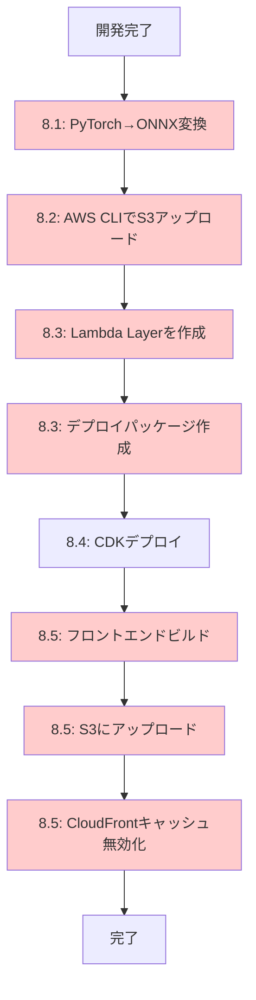
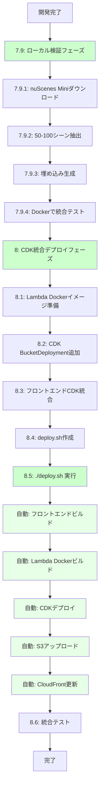

# ワークフロー比較図

## 旧ワークフロー（手動デプロイ）



**問題点:**
- 🔴 手動ステップが7つ
- 🔴 ONNX変換が必要
- 🔴 各ステップでエラーが発生しやすい
- 🔴 再現性が低い
- 🔴 10シーンのみでテスト

## 新ワークフロー（自動化デプロイ）



**改善点:**
- ✅ ローカルで大規模データ検証
- ✅ ワンコマンドデプロイ（`./deploy.sh`）
- ✅ ONNX変換不要（PyTorchそのまま）
- ✅ 自動化により再現性が高い
- ✅ 50-100シーンでテスト

## デプロイコマンド比較

### 旧方式（手動）

```bash
# ステップ1: ONNX変換
cd data_preparation
python convert_to_onnx.py

# ステップ2: S3アップロード
aws s3 cp models/ s3://bucket/models/ --recursive
aws s3 cp data/ s3://bucket/data/ --recursive
aws s3 cp images/ s3://bucket/images/ --recursive

# ステップ3: Lambda Layer作成
cd lambda
pip install -r requirements.txt -t python/
zip -r layer.zip python/
aws lambda publish-layer-version --layer-name onnx-runtime --zip-file fileb://layer.zip

# ステップ4: Lambda パッケージ作成
zip -r function.zip lambda_function.py encoders.py vector_db.py

# ステップ5: CDKデプロイ
cd infrastructure/cdk
cdk deploy

# ステップ6: フロントエンドビルド
cd integ-app/frontend
npm run build
npm run export

# ステップ7: フロントエンドアップロード
aws s3 sync out/ s3://frontend-bucket/

# ステップ8: CloudFrontキャッシュ無効化
aws cloudfront create-invalidation --distribution-id XXXXX --paths "/*"
```

**合計: 8つの手動コマンド**

### 新方式（自動化）

```bash
# ローカル検証（初回のみ）
cd data_preparation
python extract_nuscenes.py --num-scenes 100
python generate_embeddings.py
python generate_umap.py
python create_vector_db.py

cd ../integ-app
docker-compose up  # ローカルテスト

# デプロイ（ワンコマンド）
cd ../infrastructure/cdk
./deploy.sh
```

**合計: 1つのコマンド（デプロイ時）**

## アーキテクチャ比較

### 旧アーキテクチャ

```
┌─────────────────────────────────────────┐
│ Lambda Function (512MB)                 │
│ ┌─────────────────────────────────────┐ │
│ │ ONNX Runtime (Layer)                │ │
│ │ - text_transformer.onnx (200MB)     │ │
│ │ - text_projector.onnx (10MB)        │ │
│ │ - image_features.onnx (20MB)        │ │
│ │ - image_projector.onnx (10MB)       │ │
│ └─────────────────────────────────────┘ │
│ ┌─────────────────────────────────────┐ │
│ │ Function Code (10MB)                │ │
│ │ - lambda_function.py                │ │
│ │ - encoders.py (ONNX版)              │ │
│ │ - vector_db.py                      │ │
│ └─────────────────────────────────────┘ │
└─────────────────────────────────────────┘
         ↓
┌─────────────────────────────────────────┐
│ S3 Bucket                               │
│ - vector_db.json (手動アップロード)     │
│ - images/ (手動アップロード)            │
└─────────────────────────────────────────┘
```

### 新アーキテクチャ

```
┌─────────────────────────────────────────┐
│ Lambda Docker Image (2GB)               │
│ ┌─────────────────────────────────────┐ │
│ │ PyTorch Models (組み込み)           │ │
│ │ - text_projector.pt                 │ │
│ │ - image_projector.pt                │ │
│ │ - transformers (自動ダウンロード)   │ │
│ └─────────────────────────────────────┘ │
│ ┌─────────────────────────────────────┐ │
│ │ Function Code                       │ │
│ │ - lambda_function.py                │ │
│ │ - encoders.py (PyTorch版)           │ │
│ │ - vector_db.py                      │ │
│ └─────────────────────────────────────┘ │
└─────────────────────────────────────────┘
         ↓
┌─────────────────────────────────────────┐
│ S3 Bucket                               │
│ - vector_db.json (CDK自動アップロード)  │
│ - images/ (CDK自動アップロード)         │
│ - metadata/ (CDK自動アップロード)       │
└─────────────────────────────────────────┘
```

## データ規模の比較

### 旧: 小規模データ

```
nuScenes Mini (10シーン)
├── scene-0001.jpg
├── scene-0002.jpg
├── ...
└── scene-0010.jpg

合計: 10シーン
サイズ: ~50MB
```

### 新: 大規模データ

```
nuScenes Mini (50-100シーン)
├── scene-0001.jpg
├── scene-0002.jpg
├── ...
└── scene-0100.jpg

合計: 50-100シーン
サイズ: ~500MB
多様性: 高（天候、場所、交通状況）
```

## コスト比較

### 旧方式
- Lambda: 512MB × 実行時間
- S3: 手動アップロードのみ
- 開発時間: 高（手動ステップが多い）

### 新方式
- Lambda: 512MB × 実行時間（同じ）
- S3: BucketDeployment（差分のみ）
- 開発時間: 低（自動化）

**月額コスト: 同じ（$5-10）**
**開発効率: 大幅改善**

## まとめ

| 項目 | 旧方式 | 新方式 | 改善 |
|------|--------|--------|------|
| データ規模 | 10シーン | 50-100シーン | ✅ 10倍 |
| デプロイコマンド | 8つ | 1つ | ✅ 8倍効率化 |
| ONNX変換 | 必要 | 不要 | ✅ 簡素化 |
| ローカル検証 | なし | あり | ✅ 品質向上 |
| 再現性 | 低 | 高 | ✅ 信頼性向上 |
| 自動化 | 手動 | 自動 | ✅ エラー削減 |

新ワークフローにより、開発効率と品質が大幅に向上します。
